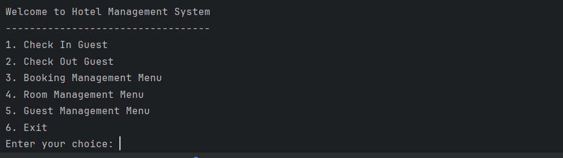
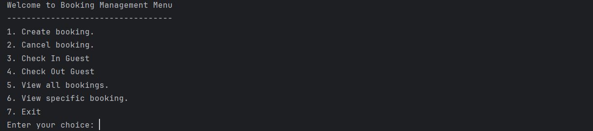
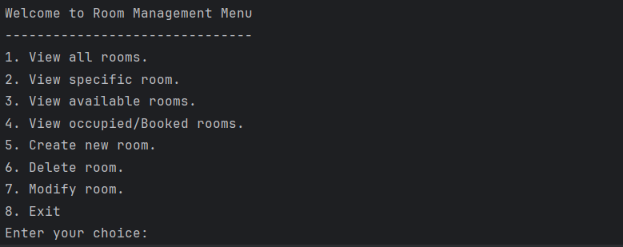
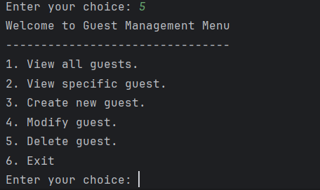

# Hotel-Guest-Check-In-Room-Booking-System

OVERVIEW
-
This project is a hotel management system built with Python. It is designed to streamline and automate essential hotel operations by addressing common challenges. 
The system focuses on:

1. Managing and storing guest information securely.
2. Tracking room availability and conditions in real time.
3. Handling reservations and cancellations efficiently.
4. Supporting smooth check-in and check-out processes with accurate timestamps.
5. Persisting data using CSV files to ensure data is not lost when the program closes.

By using modular design with persistent CSV-based storage, the system ensures that hotel staff can manage daily operations in a clear, organized, and user-friendly manner. This solution aims to provide a practical solution that improves efficiency, reduces manual errors, and keeps hotel records well-structured. This is to help reduce wait time in booking hotels.

Project Structure
-
The project is organized into multiple Python files, each responsible for a specific part of the hotel management system. This includes: 

1. `main.py`
    -
- Loads all saved data from CSV files (rooms, guests, bookings) into memory when the program starts.

- Displays the main menu and controls navigation across all the python files and all the entire system. 

- Connects all modules together (Guest, Room, Booking).
- Ensures smooth transitions between management menus.
- Has input validation to prevent invalid or duplicate records.
- Contains tabulated data display for easy readability.

- It has main menu options which includes:
    * Guest check-in.

    * Guest check-out.

    * Booking management menu.

    * Room management menu.

    * Guest management menu.

    * Exit system.
  
2. `guest class.py`:
    -
- It defines the guest class
- It has key Attributes such as:
   - Guest ID (auto-generated).
   - Full name.  
   - Phone number.  
   - Date of birth.  
   - Passport/ID number. 
- It contains the function that loads guest data into memory (`guest_registry`)
- It provides the function `save_after_modification()` to update CSV after edits.

3. `guest management`:
   -
- It provides interactive functions for managing guests. 
- It has key features such as: 
    1. `Create new guest` which validates passport, name, phone, and DOB.  
    2. `Modify guest details`: Edit name, phone, DOB, or passport number.  
    3. `View all guests`: Displays all registered guests in tabulated format.  
    4. `View specific guest`:This allows one to search for guest by passport number.  
- It saves all new guests and changes to guests.csv

4. `room class.py`:
    -
- It defines the room class
- It has key Attributes such as:
   - Room Number.
   - Room Type  
   - Capacity
   - Condition
   - Room Access PIN
   - Room Rate 
- It contains the function that loads room data into memory (`room_registry`)
- It provides the function `save_after_modification()` to update CSV after edits.
 
4. `room management.py`:
    -
    * This file handles room creation, modification, and viewing.

    * It has key functions like:

        -**Create New Room**: It creates room and helps prevent duplicate room numbers,validates capacity, access PIN, and room rate.

        - **Modify Room**: It has options to edit room number, room type, room capacity, room condition, room access PIN and room rate.

        - **Delete Room**: Removes a room and updates the CSV.

        - **View Rooms**: Allows one to view all rooms,view a specific room,view available rooms based on type, capacity, and date range and view occupied or booked rooms.
     
      *Room availability is checked against existing bookings in real time.

5. `booking_class.py`
   -

- This file defines the Booking class and manages booking data storage.

- Auto-generates a unique Booking ID.

- Stores booking attributes such as:

    * Booking ID

    * Guest ID

    * Room number

    * Booking status (Booked, Checked-In, Checked-Out)

    * Start date

    * End date

- Maintains an in-memory list called **booking_registry.**

- Saves booking records to **bookings.csv.**

- Reloads booking data into memory when the program starts.

7. `booking_management.py`
   -
- This file handles all booking-related operations.

- It has key Features like:
    * **Create Booking**: It creates a booking and helps to select room type and capacity, choose booking start and end dates and automatically checks room availability.
    
    * **Check-In Guest**: It updates booking status and records check-in time.

    * **Check-Out Guest**: It updates booking status and records check-out time.
    * **View Bookings**: Provides options to View all bookings and view specific booking.
    * **Cancel Booking**: Removes booking and updates the CSV.

**Main Menu Interface**
-
    
    This is the main navigation menu where users choose which operation to perform. All system features are accessed through this menu.

 **Booking Management Menu**
-
    This menu allows staff to manage room bookings and guest reservations.
   

**Room Management Menu**
-
    This menu manages hotel rooms, including creation, modification, and availability checks.

**Guest Management Menu**
-
    This menu handles guest records and details and provides options for modification.

Programming 1 Summative - Class Design, Test Plan and Test Results Document - https://docs.google.com/document/d/1QiJW7FdZVXbqL6DUEiVB8jdzlGIwOThi-X3xzqg13Qc/edit?usp=sharing
Approved - Project Proposal - Summative Programming 1 - https://docs.google.com/document/d/1Mloipu6s3QVCnTCzAG0sRSmys9hF7epfI8uh6eSpi0g/edit?usp=sharing
